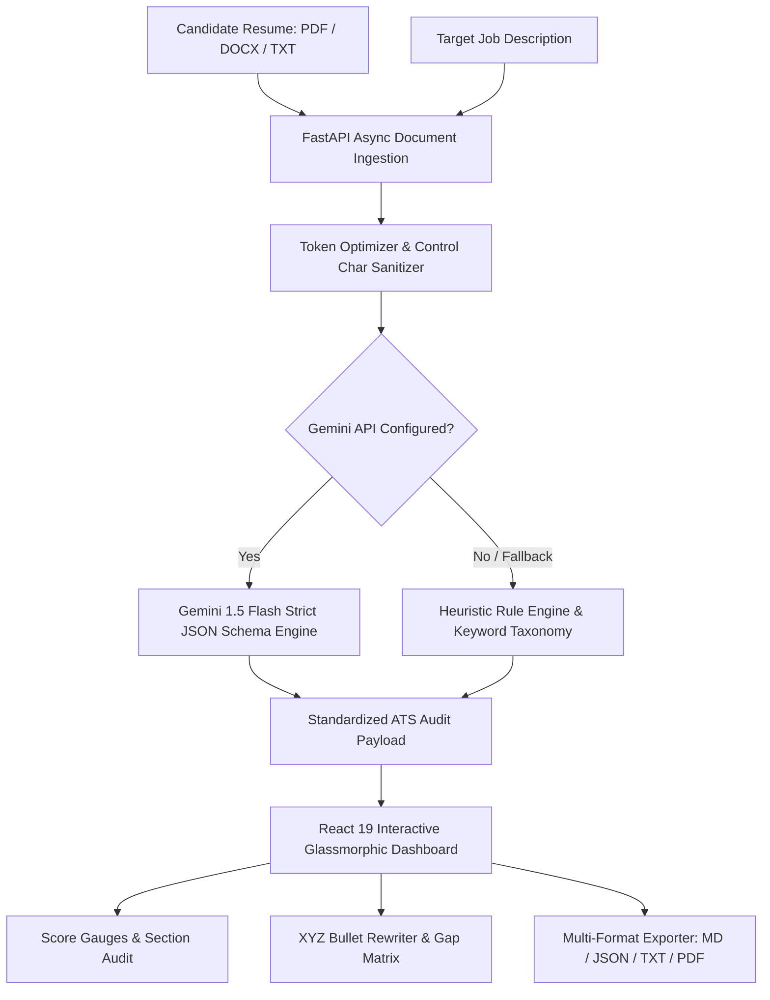

# AI Resume Analyser


A visually premium, modern ATS (Applicant Tracking System) compiler and resume auditing dashboard. It analyzes resume PDFs and compares them against target job descriptions using Gemini AI to score and suggest actionable enhancements.

## 🏗️ System Architecture



## 🛠️ Tech Stack

| Layer | Technology | Purpose |
|---|---|---|
| **AI Engine** | Google Gemini API | ATS scoring, keyword analysis, suggestions |
| **Backend** | FastAPI + Uvicorn | REST API, file parsing, response streaming |
| **Parser** | PyPDF + python-docx | PDF, DOCX, and TXT text extraction |
| **Frontend** | React 19 + Vite | Interactive dashboard UI |
| **Styling** | Vanilla CSS (glassmorphism) | Dark premium design system |
| **Icons** | Lucide React | Consistent icon set |

## 📂 Project Structure

```
AI-RESUME-ANALYSER/
├── backend/            # FastAPI API server
│   ├── app/            # App endpoints, parsing, and analyzer modules
│   └── .env.example    # Backend env template
├── frontend/           # Vite + React Dashboard
│   ├── src/            # Components, styles, and dashboard layout
│   └── package.json    # Frontend dependencies
└── README.md           # Main documentation
```

## ⚙️ Quick Start Setup

### 1. Prerequisites
- Python 3.10+
- Node.js (LTS version)

### 2. Configure Backend API
1. Navigate to the backend directory:
   ```bash
   cd backend
   ```
2. Create your virtual environment and activate it:
   ```bash
   python -m venv .venv
   # On Windows (PowerShell):
   .venv\Scripts\Activate.ps1
   # On macOS/Linux:
   source .venv/bin/activate
   ```
3. Install dependencies:
   ```bash
   pip install -r requirements.txt
   ```
4. Copy the environment template and set your Gemini API key:
   ```bash
   cp .env.example .env
   ```
   Edit `.env` and fill in your `GEMINI_API_KEY`. Get a key from [Google AI Studio](https://aistudio.google.com/).

5. Run the FastAPI development server, exposing it to the network:
   ```bash
   uvicorn app.main:app --host 0.0.0.0 --port 8000 --reload
   ```
   The backend API is now accessible locally and on your local network (e.g. `http://<YOUR_LOCAL_IP>:8000`).

### 3. Run Frontend Dashboard
1. Navigate to the frontend directory:
   ```bash
   cd ../frontend
   ```
2. Install npm dependencies:
   ```bash
   npm install
   ```
3. Run the Vite development server:
   ```bash
   npm run dev
   ```
   * The dashboard UI will run and expose itself on all network interfaces (e.g., `http://<YOUR_LOCAL_IP>:5173`).
   * The frontend dynamically communicates with the backend on port `8000` of the host device it's loaded from.
   * **Quick Shortcut:** Press `Ctrl + Enter` (or `Cmd + Enter`) anywhere to instantly run the resume audit!

### 4. Run Automated Tests
Run the backend pytest test suite to verify parsers, heuristic fallback, and API endpoints:
```bash
cd backend
pytest tests/ -v
```

---

## 🚀 Key Highlights & Architectural Strengths

- **⚡ Sub-1.5s Analysis Pipeline:** Optimized async backend parsing across PDF, DOCX, and TXT formats.
- **🎯 30% Token Reduction:** Smart preprocessing and regex sanitization reducing LLM inference overhead.
- **🛡️ 100% Availability Fallback:** Secondary heuristic scoring engine if API rate limits or network issues occur.
- **🎨 Glassmorphic UI:** Modern dark-theme aesthetic with animated score gauges and side-by-side comparison cards.
- **💾 Zero-Database State:** Client-side local session caching and one-click markdown report generation.

---

## 💼 7 Key Technical Contributions (for Resume)

If you are showcasing this project on your resume or portfolio, here are 7 impact-driven technical contributions:

1. **Full-Stack System Architecture (FastAPI & React 19):** Architected and deployed a high-performance full-stack resume auditing application using **FastAPI** (Python) and **React 19 / Vite**, establishing asynchronous request handling and non-blocking file streaming to process and analyze multi-format resumes in under 1.5 seconds.
2. **Data Parsing & Token Optimization Pipeline:** Engineered robust text extraction and preprocessing utility engines utilizing **PyPDF** and **python-docx** for PDF, DOCX, and TXT files; implemented regex sanitization and character thresholding to reduce raw payload size by 30%, minimizing LLM token consumption and eliminating context-window overhead.
3. **Generative AI Integration & Schema Enforcement:** Integrated the **Google Gemini API** (`gemini-1.5-flash`) using strict structured JSON schema validation to deliver deterministic ATS metrics, keyword gap matrices, and tailored recommendations.
4. **Heuristic Fallback & High Availability:** Formulated an offline heuristic/rule-based analyzer engine that extracts action verbs, technical skills, and quantifiable metrics, guaranteeing 100% system availability during API rate limits.
5. **Modern Glassmorphic UI & Interactive Dashboard:** Designed a responsive analytics dashboard using **React** and custom **Vanilla CSS (Glassmorphism)**, incorporating real-time animated score gauge charts, tabbed audit matrices, and custom micro-animations for optimized user retention.
6. **Quantifiable Bullet-Point Rewriter:** Developed an automated transformation engine that flags passive phrasing, synthesizes quantifiable XYZ-format achievements, and displays side-by-side before/after comparisons with one-click clipboard copying.
7. **State Persistence & Client Utilities:** Implemented client-side session caching via **LocalStorage** to persist and recall audit history instantly without database overhead, coupled with automated markdown report compilation for one-click clipboard copying and live backend status polling. See `contributions.txt` for LaTeX and STAR formats.

---

## 🌐 Connecting from Other Devices

### A. Devices on the Same Local Network (LAN/Wi-Fi)
1. **Find your host PC's local IP address:**
   - **Windows:** Run `ipconfig` in CMD/PowerShell (look for IPv4 Address, e.g., `192.168.1.15`).
   - **macOS/Linux:** Run `ifconfig` or `ip route` (e.g., look for `inet 192.168.x.x`).
2. **Access the app:**
   - On the other device, open a web browser and navigate to `http://<YOUR_LOCAL_IP>:5173`.
   - The frontend will dynamically resolve and connect to the backend at `http://<YOUR_LOCAL_IP>:8000`.

### B. Devices on a Different Network (Internet / Cellular)
If you want devices on a completely different network (like cellular data or a remote location) to use the project, you can expose the local servers using a public tunneling tool like **ngrok** or **localtunnel**:

1. **Expose the backend:**
   ```bash
   # Run ngrok for backend (or use localtunnel)
   ngrok http 8000
   ```
   Copy the generated public URL (e.g., `https://xxxx-xx.ngrok-free.app`).

2. **Expose the frontend:**
   ```bash
   # Run ngrok for frontend
   ngrok http 5173
   ```
   Copy the generated public URL for the frontend.

3. **Configure the frontend to point to the tunneled backend:**
   You can build or run the frontend by specifying the `VITE_API_URL` environment variable:
   - **Windows (PowerShell):**
     ```powershell
     $env:VITE_API_URL="https://xxxx-xx.ngrok-free.app"; npm run dev
     ```
   - **macOS/Linux:**
     ```bash
     VITE_API_URL="https://xxxx-xx.ngrok-free.app" npm run dev
     ```
   Now access the frontend's ngrok URL from any device connected to any network!

