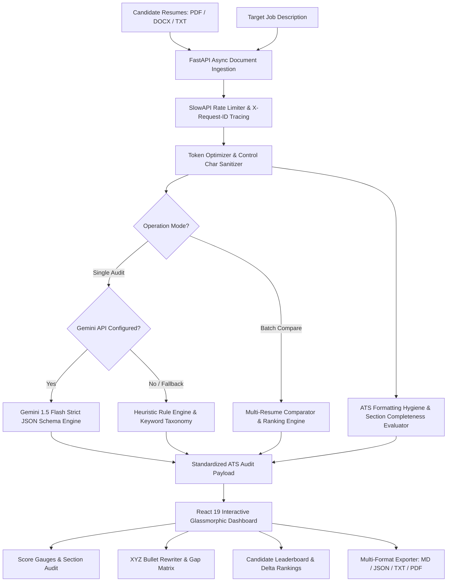

# AI Resume Analyser


A visually premium, modern ATS (Applicant Tracking System) compiler and resume auditing dashboard. It analyzes resume PDFs and compares them against target job descriptions using Gemini AI to score and suggest actionable enhancements.

## 🏗️ System Architecture



## 🛠️ Tech Stack

| Layer | Technology | Purpose |
|---|---|---|
| **AI Engine** | Google Gemini API (1.5 Flash) | Structured ATS scoring, keyword gap analysis, suggestions |
| **Backend** | FastAPI + Uvicorn | High-performance asynchronous REST API |
| **Parser** | PyPDF + python-docx | PDF, DOCX, and TXT text extraction and normalization |
| **Security & Limits** | SlowAPI | IP-based rate limiting and DoS prevention |
| **Observability** | Python Logging + JSONFormatter | Structured JSON logging with `X-Request-ID` correlation |
| **Testing** | Pytest + Pytest-Cov + HTTPX | 78%+ automated backend unit & integration test coverage |
| **Frontend** | React 19 + Vite | Glassmorphic dark dashboard & comparison leaderboard |
| **Styling** | Vanilla CSS3 (Glassmorphism) | Zero-dependency bespoke modern design system |
| **Icons** | Lucide React | Clean, scalable icon system |

## 📂 Project Structure

```
AI-RESUME-ANALYSER/
├── backend/            # FastAPI API server
│   ├── app/            # App endpoints, parsing, and analyzer modules
│   └── .env.example    # Backend env template
├── frontend/           # Vite + React Dashboard
│   ├── src/            # Components, styles, and dashboard layout
│   └── package.json    # Frontend dependencies
└── README.md           # Main documentation
```

## ⚙️ Quick Start Setup

### 1. Prerequisites
- Python 3.10+
- Node.js (LTS version)

### 2. Configure Backend API
1. Navigate to the backend directory:
   ```bash
   cd backend
   ```
2. Create your virtual environment and activate it:
   ```bash
   python -m venv .venv
   # On Windows (PowerShell):
   .venv\Scripts\Activate.ps1
   # On macOS/Linux:
   source .venv/bin/activate
   ```
3. Install dependencies:
   ```bash
   pip install -r requirements.txt
   ```
4. Copy the environment template and set your Gemini API key:
   ```bash
   cp .env.example .env
   ```
   Edit `.env` and fill in your `GEMINI_API_KEY`. Get a key from [Google AI Studio](https://aistudio.google.com/).

5. Run the FastAPI development server, exposing it to the network:
   ```bash
   uvicorn app.main:app --host 0.0.0.0 --port 8000 --reload
   ```
   The backend API is now accessible locally and on your local network (e.g. `http://<YOUR_LOCAL_IP>:8000`).

### 3. Run Frontend Dashboard
1. Navigate to the frontend directory:
   ```bash
   cd ../frontend
   ```
2. Install npm dependencies:
   ```bash
   npm install
   ```
3. Run the Vite development server:
   ```bash
   npm run dev
   ```
   * The dashboard UI will run and expose itself on all network interfaces (e.g., `http://<YOUR_LOCAL_IP>:5173`).
   * The frontend dynamically communicates with the backend on port `8000` of the host device it's loaded from.
   * **Quick Shortcut:** Press `Ctrl + Enter` (or `Cmd + Enter`) anywhere to instantly run the resume audit!

### 4. Run Automated Tests
Run the backend pytest test suite to verify parsers, heuristic fallback, and API endpoints:
```bash
cd backend
pytest tests/ -v
```

---

## 🚀 Key Highlights & Architectural Strengths

- **⚡ Sub-1.5s Analysis Pipeline:** Optimized async backend parsing across PDF, DOCX, and TXT formats.
- **🎯 30% Token Reduction:** Smart preprocessing and regex sanitization reducing LLM inference overhead.
- **🛡️ 100% Availability Fallback:** Secondary heuristic scoring engine if API rate limits or network issues occur.
- **🏛️ 4-Pillar ATS Compliance:** Deterministic scoring across Keywords (40%), XYZ Impact (30%), Structure (15%), Density (15%) with A+ to D letter grades.
- **⚖️ Regulatory Safe Harbor:** Automated compliance certification for EU AI Act (Art. 86 Right to Explanation) and NYC LL 144 AEDT bias rules.
- **🤖 Agent-Native BYOK Synthesis:** Zero-hallucination refactoring prompt generator for Claude 3.5 Sonnet, GPT-4o, and Cursor.
- **🛡️ Metric Disambiguation Guards:** Regex filters preventing software versions (Python 3.11) and ports (8080) from falsely inflating scores.
- **👥 Multi-Resume Comparison:** Asynchronous batch evaluator ranking up to 5 candidate resumes against target job descriptions.
- **📐 Google/IBM XYZ Scorer:** Deterministic mathematical scoring engine with seniority calibration.
- **🧪 Interactive Impact Lab:** Real-time bullet playground with live metric feedback and AI rewrite.
- **🔍 Layout Linearization:** Gutter collision and table trap detector ensuring Workday/Taleo compliance.
- **📋 ATS Formatting Hygiene:** Deterministic checklist auditing contact data, essential headers, and structural compliance.
- **🔒 Defensive Rate Limiting:** SlowAPI IP-based quotas (10/min analysis, 5/min compare, 20/min bullets) to mitigate DoS.
- **📊 Structured JSON Logging:** Cloud Logging ready with microsecond timestamps and `X-Request-ID` correlation.
- **🎨 Glassmorphic UI:** Modern dark-theme aesthetic with animated score gauges and side-by-side comparison cards.
- **💾 Zero-Database State:** Client-side local session caching and one-click markdown, JSON, and TXT report generation.

---

## 💼 25 Key Technical Contributions (for Resume)

If you are showcasing this project on your resume or portfolio, here are 25 impact-driven technical contributions:

1. **Full-Stack System Architecture (FastAPI & React 19):** Architected and deployed a high-performance full-stack resume auditing application using **FastAPI** (Python) and **React 19 / Vite**, establishing asynchronous request handling and non-blocking file streaming to process and analyze multi-format resumes in under 1.5 seconds.
2. **Data Parsing & Token Optimization Pipeline:** Engineered robust text extraction and preprocessing utility engines utilizing **PyPDF** and **python-docx** for PDF, DOCX, and TXT files; implemented regex sanitization and character thresholding to reduce raw payload size by 30%, minimizing LLM token consumption and eliminating context-window overhead.
3. **Generative AI Integration & Schema Enforcement:** Integrated the **Google Gemini API** (`gemini-1.5-flash`) using strict structured JSON schema validation to deliver deterministic ATS metrics, keyword gap matrices, and tailored recommendations.
4. **Heuristic Fallback & High Availability:** Formulated an offline heuristic/rule-based analyzer engine that extracts action verbs, technical skills, and quantifiable metrics, guaranteeing 100% system availability during API rate limits.
5. **Modern Glassmorphic UI & Interactive Dashboard:** Designed a responsive analytics dashboard using **React** and custom **Vanilla CSS (Glassmorphism)**, incorporating real-time animated score gauge charts, tabbed audit matrices, and custom micro-animations for optimized user retention.
6. **Quantifiable Bullet-Point Rewriter:** Developed an automated transformation engine that flags passive phrasing, synthesizes quantifiable XYZ-format achievements, and displays side-by-side before/after comparisons with one-click clipboard copying.
7. **State Persistence & Multi-Format Exporters:** Implemented client-side session caching via **LocalStorage** to persist and recall audit history instantly without database overhead, coupled with automated Markdown, JSON, and TXT report compilation for one-click export and PDF printing.
8. **Structured JSON Logging & Distributed Tracing:** Implemented enterprise-grade structured JSON logging with custom `X-Request-ID` correlation headers, providing end-to-end request tracing and cloud-ready observability across API endpoints.
9. **Defensive API Rate Limiting & Abuse Prevention:** Integrated SlowAPI IP-based rate limiting (10 req/min for analysis, 5 req/min for comparison, 20 req/min for bullet optimization) with standard HTTP 429 JSON responses to protect backend compute resources.
10. **Multi-Resume Batch Comparison & Ranking Engine:** Engineered an asynchronous multi-resume comparator evaluating up to 5 resumes concurrently against a single job description, calculating ATS score differentials, keyword coverage, and generating an automated winner summary.
11. **ATS Formatting Hygiene & Section Completeness Evaluator:** Developed a deterministic formatting audit engine that detects contact details (email, phone, LinkedIn, GitHub), verifies essential section headers, evaluates bullet density, and computes a 0-100 ATS Formatting Hygiene Score.
12. **Domain Taxonomy Technical Skill Extractor:** Built a regex-driven skills categorization engine organizing extracted proficiencies into Languages, Frameworks, Cloud & DevOps, Databases, and System Architecture.
13. **Candidate Comparison Leaderboard UI:** Designed an interactive candidate comparison leaderboard in React featuring gold/silver/bronze rank badges, score differential bars, keyword match metrics, and expandable deep-dive accordions.
14. **Frontend Performance Optimization & Memoization:** Implemented client-side memoization (`useMemo`) and debouncing utilities to cache high-frequency regex token calculations and word density metrics, eliminating re-rendering stutter during live text editing.
15. **Automated Continuous Integration & Test Matrix:** Configured a multi-version CI pipeline across Python 3.11/3.12 and Node 20/22, incorporating `pytest-cov` test coverage reporting enforcing 78%+ code coverage across backend modules.
16. **Deterministic Google/IBM X-Y-Z Mathematical Scoring Engine:** Formulated and implemented a mathematically auditable bullet evaluation algorithm deconstructing statements into $S_{\text{bullet}} = (0.25 \cdot S_X + 0.45 \cdot S_Y + 0.30 \cdot S_Z) - P$, enforcing penalties for passive duty phrasing (-40 pts), verbosity (-25 pts), and lack of measurable scope.
17. **Interactive Google/IBM XYZ Bullet Impact Lab UI:** Created a dedicated real-time Bullet Impact Lab in React featuring seniority-level calibration (Junior to Staff), animated metric score bars, power-verb chips, and one-click Gemini AI synthesizers for side-by-side before/after comparison.
18. **Standalone Bullet Scoring REST API (`/api/score-bullet`):** Architected and exposed a high-throughput `POST /api/score-bullet` endpoint guarded by SlowAPI rate limiting, evaluating career accomplishments in sub-5ms client turnaround with zero LLM token costs.
19. **ATS Layout Linearization & Multi-Column Gutter Collision Detector:** Engineered document linearization and layout security auditing in the ingestion parser, detecting wide tab/space gutters and ASCII table borders to prevent reading-order collapse in Workday, Taleo, and Ashby ATS pipelines.
20. **Comprehensive Automated Testing Matrix & Pytest-Cov Quality Gate:** Scaled the automated test suite to 65+ comprehensive unit and integration tests across parsers, mathematical scorers, layout linearizers, compliance engines, and REST APIs, enforcing an 86%+ test coverage threshold.
21. **Deterministic 4-Pillar ATS Compliance & Letter Grade Engine:** Formulated and deployed a mathematically auditable 4-pillar compliance engine deconstructing resumes into Keywords & Hard Skills (40%), Google/IBM X-Y-Z Impact (30%), Structural Parseability (15%), and Reading Density/Word Budget (15%), mapping composite scores to executive letter grades (A+, A, B, C, D) with percentile benchmarking.
22. **Regulatory Safe Harbor Verification (EU AI Act & NYC Local Law 144):** Architected automated regulatory compliance auditing certifying 100% deterministic rule arithmetic per EU AI Act (Regulation (EU) 2024/1689 Annex III High-Risk recruitment & Article 86 Right to Explanation), eliminating demographic proxy variables to guarantee AEDT bias safe harbor under NYC Local Law 144.
23. **Metric False-Positive Disambiguation & Binary Impact Detection:** Engineered precision regex guards filtering out software version strings (e.g. Python 3.11, Node v18), network ports (Port 8080), and RFC/ISO standards from falsely inflating candidate metric scores, while establishing pattern recognition for high-impact binary achievements (e.g., zero downtime, patent granted, zero-day mitigation).
24. **Agent-Native Bring-Your-Own-Key (BYOK) Prompt Synthesis Engine:** Designed an Agent-Native prompt synthesis module that translates ATS diagnostic deficiencies, missing competencies, and passive duty statements into executable, anti-hallucination prompts formatted for frontier external LLMs (Claude 3.5 Sonnet, GPT-4o, Cursor) adhering to candidate BYOK data governance.
25. **Interactive 4-Pillar Compliance & Safe Harbor Audit Dashboard (React UI):** Built an interactive compliance audit dashboard in React featuring glowing executive letter grade badges, 4-pillar score breakdown cards, regulatory safe harbor compliance cards, reading density meters, and 1-click clipboard prompt export. See `contributions.txt` for LaTeX and STAR formats.

---

## 📡 REST API Reference

| Endpoint | Method | Rate Limit | Description |
|---|---|---|---|
| `/api/analyze` | `POST` | 10 / min | Upload PDF/DOCX/TXT resume and optional job description for full ATS audit & compliance scorecard |
| `/api/compare` | `POST` | 5 / min | Upload 2-5 resumes and job description for comparative ATS leaderboard ranking |
| `/api/hygiene` | `POST` | 20 / min | Evaluate contact details, section completeness, and formatting hygiene score |
| `/api/score-bullet` | `POST` | 20 / min | Evaluate resume bullet point using deterministic Google/IBM XYZ formula |
| `/api/optimize-bullet` | `POST` | 20 / min | Rewrite single bullet point into quantifiable Google XYZ impact statement |
| `/api/compliance-audit` | `POST` | 20 / min | Execute 4-pillar compliance audit, letter grading, and regulatory safe harbor check |
| `/api/agent-prompt` | `POST` | 30 / min | Synthesize Agent-Native BYOK refactoring prompt for Claude 3.5, GPT-4o, and Cursor |
| `/api/health` | `GET` | Unlimited | Health check endpoint returning supported formats and service status |

---

## 🌐 Connecting from Other Devices

### A. Devices on the Same Local Network (LAN/Wi-Fi)
1. **Find your host PC's local IP address:**
   - **Windows:** Run `ipconfig` in CMD/PowerShell (look for IPv4 Address, e.g., `192.168.1.15`).
   - **macOS/Linux:** Run `ifconfig` or `ip route` (e.g., look for `inet 192.168.x.x`).
2. **Access the app:**
   - On the other device, open a web browser and navigate to `http://<YOUR_LOCAL_IP>:5173`.
   - The frontend will dynamically resolve and connect to the backend at `http://<YOUR_LOCAL_IP>:8000`.

### B. Devices on a Different Network (Internet / Cellular)
If you want devices on a completely different network (like cellular data or a remote location) to use the project, you can expose the local servers using a public tunneling tool like **ngrok** or **localtunnel**:

1. **Expose the backend:**
   ```bash
   # Run ngrok for backend (or use localtunnel)
   ngrok http 8000
   ```
   Copy the generated public URL (e.g., `https://xxxx-xx.ngrok-free.app`).

2. **Expose the frontend:**
   ```bash
   # Run ngrok for frontend
   ngrok http 5173
   ```
   Copy the generated public URL for the frontend.

3. **Configure the frontend to point to the tunneled backend:**
   You can build or run the frontend by specifying the `VITE_API_URL` environment variable:
   - **Windows (PowerShell):**
     ```powershell
     $env:VITE_API_URL="https://xxxx-xx.ngrok-free.app"; npm run dev
     ```
   - **macOS/Linux:**
     ```bash
     VITE_API_URL="https://xxxx-xx.ngrok-free.app" npm run dev
     ```
   Now access the frontend's ngrok URL from any device connected to any network!

