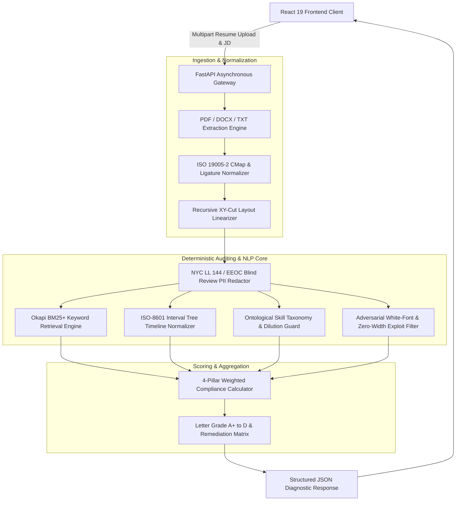
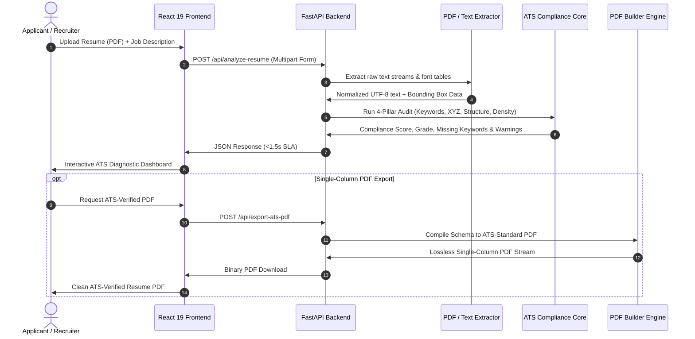

# System Architecture & Data Flow — AI Resume Analyser

This document provides complete end-to-end architectural schematics, sequence flows, and component interactions for the AI Resume Analyser ecosystem.

---

## 🏗️ High-Level System Architecture

---

## 🔄 End-to-End Sequence Diagram

